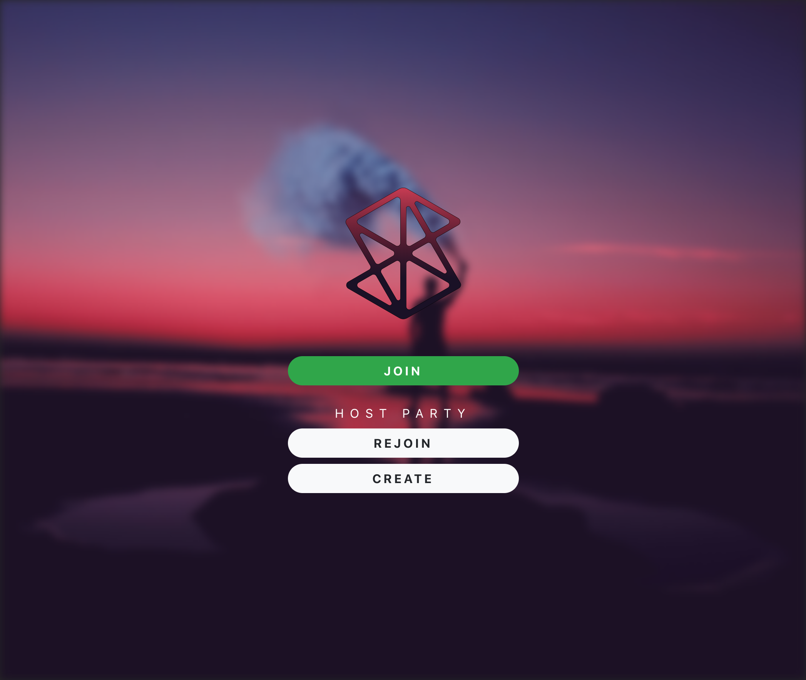

# YouTube Party Mode - written in Scala(.js)

High-level languages: Scala - Group project (2017/2018)

## Minimal Requirements
 
1. SBT Version 1.1.0
2. nodejs + npm
3. yarn
4. IntelliJ IDEA 2017.3.4 (for editing)

## Backend Setup ([dev-repository](https://github.com/griase94/scalable_server))

1. Clone repository
2. `cd scalable/be/`
3. `sbt run`

## Frontend Setup ([dev-repository](https://github.com/andreasellw/scalable_frontend))

1. Clone repository
2. `cd scalable/fe/frontend/`
3. `yarn install`
4. `sbt fastOptJS`
5. `npm run start` opens in browser `http://localhost:8080`

## Access locally running server and website from mobile device

1. Find out your local IP adress 
2. open `frontend/package.json` and edit `"scripts": { "mobile": "API_HOST=...:5000` to `API_HOST=yourlocalIPadress:5000`
3. `sbt fastOptJS`
4. `npm run mobile`
5. Open your mobile browser and go to `yourlocalIPadress:8080` (you might have to disable firewall first)

## Projektidee

Prinzipiell soll die Anwendung eine Möglichkeit für Partygäste bieten, mit dem Gastgeber und untereinander zu interagieren.
Der Gastgeber kann als Administrator einen Room anlegen, welchem Partygäste nach Eingabe von Room-Name und selbstgewähltem Nutzername auf einer Website beitreten können. Anschließend haben die Gäste die Möglichkeit über die Musik, welche auf dem Gerät des Administrator abgespielt werden soll, abzustimmen. Dabei soll es verschiedene Konfigurationsmöglichkeiten durch den Gastgeber geben auf welche Art und Weise die Playlist durch die Gäste beeinflusst werden kann. 
Zusätzlich gibt es einen Foto-Feed, in welchem die Gäste ihre Party-Bilder direkt hochladen können und dadurch direkt für andere Gäste sichtbar machen können. Die Bilder können außerdem mit Up- und Down-Votes versehen werden und werden dementsprechend sortiert.

## Architektur

Jeweils Webapplikation für Admin/Gastgeber zur Musikwiedergabe und Nutzer/Besucher für Abstimmung über die Musik und Dar- sowie Erstellung des Fotofeeds.
REST-Backend, welches die Anwendungslogik realisiert und die Daten in einer Datenbank verwaltet.
Vorraussichtlich eingesetzte Technologien:

- Play
- Scala.js
- Akka
- Slick

## Team

- Andreas Ellwanger
- Andreas Griesbeck
- Stephan Holzner
- Timo Erdelt
